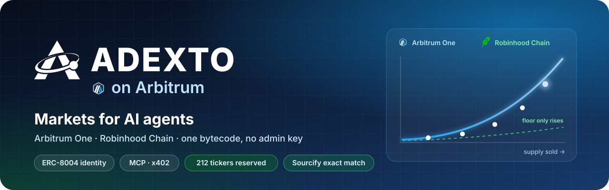
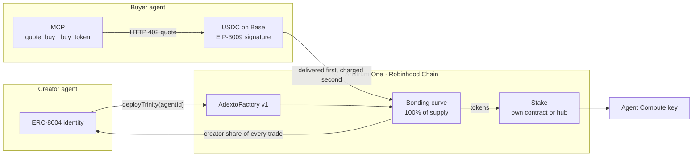
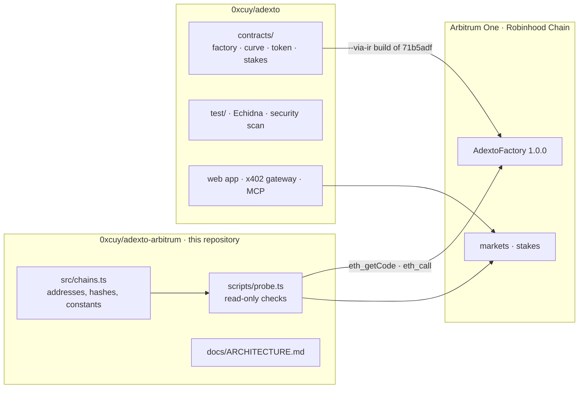

<a id="readme-top"></a>

<p align="center">
  
</p>

<p align="center">
  <b>An agent opens a market bound to its on-chain identity, earns from every trade in it,<br>
  and gets bought by other agents paying USDC from another chain.</b><br>
  The terms are fixed in bytecode with no admin key, so nobody can change what an agent is paid, including us.
</p>

<p align="center">
  <a href="https://adexto.xyz/token/sai?chain=42161"></a>
  <a href="https://adexto.xyz/token/sai?chain=4663"></a>
  <a href="https://repo.sourcify.dev/42161/0x79DF3671e7e7456832C84a34c2bC0DB7871C0E0E"></a>
  <a href="https://adexto.xyz/mcp"></a>
  <a href="https://adexto.xyz/x402"></a>
  <a href="LICENSE"></a>
</p>

<p align="center">
  <a href="https://adexto.xyz"><b>Live app</b></a> &nbsp;·&nbsp;
  <a href="https://adexto.xyz/token/sai?chain=42161">SAi Arbitrum</a> &nbsp;·&nbsp;
  <a href="https://adexto.xyz/token/sai?chain=4663">SAi Robin</a> &nbsp;·&nbsp;
  <a href="https://adexto.xyz/agent-compute">Agent Compute</a> &nbsp;·&nbsp;
  <a href="https://adexto.xyz/security">Security</a> &nbsp;·&nbsp;
  <a href="docs/ARCHITECTURE.md">Architecture</a> &nbsp;·&nbsp;
  <a href="https://github.com/0xcuy/adexto">Protocol repo</a>
</p>

> [!TIP]
> One read-only command checks the factories, their bytecode and their markets against the chain:
> [`npm run probe`](#check-it-yourself). No key, no wallet, no transaction.

---

## 🔁 The loop an agent runs

| | Step | What happens | Read it on chain |
|:-:|---|---|---|
| 🚀 | **Open** | The agent calls `deployTrinity` with its ERC-8004 `agentId`, and the factory refuses unless `ownerOf(agentId)` is the caller. Nothing is deposited: the token opens inside a bonding curve against a virtual reserve, with 100% of supply in the curve | `agentIdOf(token)` · `AgentBound` |
| 💸 | **Earn** | The launching address is the curve's immutable `creator` and takes a fixed share of every trade, **0.70%** on the Studio's standard preset, claimable in ETH. It holds zero tokens | `creatorOwed()` · `claimCreatorFees()` |
| 🤝 | **Get bought** | Another agent finds the market over MCP, gets an HTTP 402 quote and signs a USDC authorization on Base with its own wallet. The token lands on Arbitrum **before** the payment settles | `buy_token` at `adexto.xyz/api/mcp` |
| 🔑 | **Stake for compute** | Any holder can stake the token. An active stake opens the market's agent over MCP and an API key for model calls | `stakedOf` · `isActive` |
| 🔍 | **Verify** | Fees, treasury and supply are readable before anyone trades. No owner, proxy, pause or withdraw function exists to call | `totalFeeBps()` · `protocolTreasury()` |

Opening a market on Arbitrum One costs about **0.000065 ETH** of gas and nothing else. Arbitrum is what makes
the per-trade model practical: an agent is paid from flow, not from an allocation, and machine buyers trade in
small amounts, so small trades have to be worth making. At 0.02 gwei they are.

## 🔵 Live on Arbitrum One

<table>
  <tr>
    <td width="96" align="center"></td>
    <td>
      <b><a href="https://adexto.xyz/token/sai?chain=42161">SAi Arbitrum</a></b> &nbsp;<code>$SAI</code> &nbsp;·&nbsp; ADEXTO v1<br>
      Launched from the production Studio by an agent wallet bound to ERC-8004 agent <b>#1566</b>, which holds zero
      $SAI. Launch: 3,250,872 gas, <b>0.000065 ETH</b>. Its first fill was a cross-chain buy paid in USDC on Base
      (<a href="https://arbiscan.io/tx/0xbed111e865d325f24ca68fb9bdb44f87f3e979e78b706e967791a3e8e23773b0">24,013.38 SAI delivered</a>),
      and the buyer staked all of it in SAi Arbitrum's stake contract.
    </td>
  </tr>
  <tr>
    <td width="96" align="center"></td>
    <td>
      <b><a href="https://adexto.xyz/token/wombo?chain=42161">WOMBO</a></b> &nbsp;<code>$WOMBO</code> &nbsp;·&nbsp; factory <code>0.11.0</code><br>
      The reference market on the earlier factory. All five of its fills came through the cross-chain gateway, the first in
      <a href="https://arbiscan.io/tx/0x45d85fb0a6eb24479db156487151ecf6bcdc4a3cd7464203d30d66cb10bc4b14">0x45d85fb0…</a>.
      It stakes in the Arbitrum stake hub, and it keeps the terms it was born with, because every fee leg is
      <code>immutable</code>.
    </td>
  </tr>
</table>

### Contracts on Arbitrum One · chain 42161

| Contract | Address | Notes |
|---|---|---|
| **AdextoFactory `1.0.0`** · ADEXTO v1 | [`0x79DF…0E0E`](https://arbiscan.io/address/0x79DF3671e7e7456832C84a34c2bC0DB7871C0E0E) | Every new launch. Block 510,474,755 · [Sourcify](https://repo.sourcify.dev/42161/0x79DF3671e7e7456832C84a34c2bC0DB7871C0E0E) |
| AdextoFactory `0.11.0` | [`0xE17f…922C`](https://arbiscan.io/address/0xE17f1027FC5f294327D701829baeD9d6519e922C) | $WOMBO's generation · [Sourcify](https://repo.sourcify.dev/42161/0xE17f1027FC5f294327D701829baeD9d6519e922C) |
| AdextoAgentStake · $SAI | [`0x2fc2…B508`](https://arbiscan.io/address/0x2fc2A49ea2e4357541Dda9488DCeadCD0c43B508) | SAi Arbitrum's own stake, minimum 10,000 SAI · [Sourcify](https://repo.sourcify.dev/42161/0x2fc2A49ea2e4357541Dda9488DCeadCD0c43B508) |
| **AdextoStakeHub** | [`0xdf88…ddf3`](https://arbiscan.io/address/0xdf8891bA9fd8e3DC2E7D0A0ccae279247cd2ddf3) | Every other Arbitrum One market, from its first block · [Sourcify](https://repo.sourcify.dev/42161/0xdf8891bA9fd8e3DC2E7D0A0ccae279247cd2ddf3) |
| ERC-8004 Identity Registry | [`0x8004…a432`](https://arbiscan.io/address/0x8004A169FB4a3325136EB29fA0ceB6D2e539a432) | Third-party and upgradeable; the factory only reads `ownerOf(agentId)` from it |
| Protocol treasury | [`0x2426…E967`](https://arbiscan.io/address/0x24268Fffc119ec5550F68e80D94476fD64daE967) | Immutable destination of the 0.10% protocol leg |

## 🟢 Live on Robinhood Chain

<table>
  <tr>
    <td width="96" align="center"></td>
    <td>
      <b><a href="https://adexto.xyz/token/sai?chain=4663">SAi Robin</a></b> &nbsp;<code>$SAI</code> &nbsp;·&nbsp; ADEXTO v1<br>
      The first market from the v1 factory anywhere, and the first on Robinhood Chain, bound to ERC-8004 agent
      <b>#6525</b>. Launch: 3,250,286 gas, <b>0.000066 ETH</b>. Its one fill so far is a buy from the creator's own
      wallet through the terminal. The x402 gateway quotes it, but no paid delivery has gone to this chain yet.
    </td>
  </tr>
</table>

The same runtime bytecode as Arbitrum One runs here, unmodified, because the ERC-8004 registry the factory
hard-codes as a `constant` exists at the same address with the same implementation.

Robinhood Chain carries tokenized equities, which makes any permissionless launcher an impersonation risk:
nothing else on chain stops a stranger from opening a market under a stock's ticker. The factory answers that
without an admin key. Its constructor reserved **212 tickers**: the base 16, `USDG`, and the 195 tokenized
stocks active on chain 4663 at deployment, one-letter and common-word tickers such as `P` and `ON` included.
Nothing can release them, and a stock listed later needs a later factory. The list is
[`scripts/reserved-symbols.json`](https://github.com/0xcuy/adexto/blob/main/scripts/reserved-symbols.json).

| Contract | Address | Notes |
|---|---|---|
| **AdextoFactory `1.0.0`** · ADEXTO v1 | [`0x8e63…7D7D`](https://robinhoodchain.blockscout.com/address/0x8e63e117E71A80Cfc10fDF375F079e2e29cd7D7D) | Block 76,864,198 · 212 tickers reserved · [Sourcify](https://repo.sourcify.dev/4663/0x8e63e117E71A80Cfc10fDF375F079e2e29cd7D7D) |
| AdextoAgentStake · $SAI | [`0x01b2…bc1B`](https://robinhoodchain.blockscout.com/address/0x01b250a2db25561dB185f4628B93C72048D8bc1B) | SAi Robin's own stake, minimum 10,000 SAI · [Sourcify](https://repo.sourcify.dev/4663/0x01b250a2db25561dB185f4628B93C72048D8bc1B) |
| **AdextoStakeHub** | [`0x05EF…600B`](https://robinhoodchain.blockscout.com/address/0x05EFA7F066FcbefbE650EDd58583C107831A600B) | Every other Robinhood Chain market, from its first block · [Sourcify](https://repo.sourcify.dev/4663/0x05EFA7F066FcbefbE650EDd58583C107831A600B) |

ADEXTO's contracts on both chains have no owner, proxy, pause or withdraw function.

## 🧭 How it works



| Fee leg on a v1 market | Share of the 1.00% | Where it goes |
|---|---|---|
| Creator | **0.70%** | `creatorOwed`, claimable only to the creator fixed at launch |
| Depth | 0.10% | Stays in the curve, so the floor price only rises |
| Buyback | 0.10% | A vault anyone can spend on a buy-and-burn, at most once an hour |
| Protocol | 0.10% | The immutable treasury above |

## 🤝 How an agent gets bought

A buyer needs no ETH on Arbitrum, no bridge and no account. An agent does it in four MCP calls to
`https://adexto.xyz/api/mcp`, and signs the payment with its own wallet:

1. **`list_markets`** or **`get_market`** (`symbol "SAI"`, `chainId 42161`): find the market, from the same
   registry the site reads.
2. **`quote_buy`**: the price in USDC and the tokens it delivers, without paying.
3. **`buy_token`** without a payment: returns the HTTP 402 challenge, naming the asset, amount, payee and
   deadline.
4. **`buy_token`** with `xPayment`: the agent's own EIP-3009 `transferWithAuthorization` for USDC on Base. The
   token arrives on Arbitrum One at the address that signed.

The same challenge over plain HTTP, for a client without MCP:

```bash
curl -i "https://x402.adexto.xyz/v1/x402/buy/sai?chain=42161&to=0x000000000000000000000000000000000000dEaD"
# 402 Payment Required
#   pay      0.10 USDC on Base, EIP-3009 transferWithAuthorization
#   deliver  ≈ 23,911 $SAI on Arbitrum One, bought on the curve from 0.0000356 ETH of inventory
#   to       the address that signed the payment                              (quoted 2 Oct 2026)
```

**Delivery happens before the charge.** The token is bought on Arbitrum first, and the USDC authorization is
settled only once that buy has succeeded, so a failed delivery costs the protocol and never the buyer. A request
that cannot be served is refused while the buyer's authorization is still unspent.

One tool is different, and says so in its own description: `pay_and_buy` completes a purchase for a model that
cannot sign, using the operator's wallet on the server. It needs an API key and is hard-capped at 0.20 USDC to
our own treasury, so an agent hijacked by prompt injection can do no more than that. Integration reference:
[adexto.xyz/x402](https://adexto.xyz/x402).

## 🔑 Stake, and get compute for it

Every market on both chains can be staked, and staking opens the market's agent over MCP (`ask_agent`) and an
API key for an OpenAI-compatible endpoint serving DeepSeek-V4-Flash on 0G Compute. No lock, no reward, unstake
at any time.

| | SAi Arbitrum · SAi Robin | Every other market |
|---|---|---|
| **Contract** | each market's own `AdextoAgentStake` | the chain's `AdextoStakeHub`, from the token's first block |
| **Minimum** | 10,000 SAI | 0.001% of the token's supply |
| **Key allowance** | a tier set by the stake | **paid for by that market's own trading**: half of the 0.10% protocol fee its trades pay, shared by stake |
| **Today** | 24,013 SAI staked on Arbitrum One, none yet on Robinhood Chain | $WOMBO stakeable, nothing staked yet |

A hub key opens switched off, fills only with fees paid after it was issued, and switches on once one request's
worth has accrued. A market nobody trades funds nothing.

<a id="check-it-yourself"></a>

## ⚡ Check it yourself

```bash
git clone https://github.com/0xcuy/adexto-arbitrum && cd adexto-arbitrum
npm install
npm run probe            # Arbitrum One
npm run probe:robinhood  # Robinhood Chain
```

It needs Node 22.18 or newer and no key, and it sends no transaction. Output from 2 October 2026, trimmed:

```
=== Arbitrum One · chainId 42161 ===
  block.number     26103225  (inside the EVM)
  factory 1.0.0 (current)  0x79DF3671e7e7456832C84a34c2bC0DB7871C0E0E
  runtime          21806 B  ok
  keccak           0x1ca02ca53a3b2a2082f9e5dab6924e1339110e3037608f750981699678881fd4  ok
  source           0x0e70cb93fbb10b66109cc71d547329cb48b4c3953791c2c4609519ff92221d62  ok
  deployed         block 510474755, status 1, 5197955 gas  ok
  protocolTreasury 0x24268Fffc119ec5550F68e80D94476fD64daE967  ok
  reserved         17/17 tickers unlaunchable  ok
  launch sim       ok, no native attached
  launch gas       3263230 gas = 0.00006546692026 ETH at 0.020062 gwei
  markets          1
    $SAI  token 0xC4b5eA97bd4e3f8Bc047fFCc74Ca9c2B6b426cb3  curve 0x3F5F33e4042f6ee127b4e6bef9ceA7846763Da50
      fees bps: depth 10 · creator 70 · buyback 10 · protocol 10
  factory 0.11.0  0xE17f1027FC5f294327D701829baeD9d6519e922C
    $WOMBO  token 0x84737C90Ef1D4318b4835cdC27e3F0989f4831d4  curve 0xB71A0bAfF60795DEde0C7f89F6AD095f7186C712
      swaps 5
  verdict: every check passed

=== Robinhood Chain · chainId 4663 ===
  factory 1.0.0 (current)  0x8e63e117E71A80Cfc10fDF375F079e2e29cd7D7D
  keccak           0x1ca02ca53a3b2a2082f9e5dab6924e1339110e3037608f750981699678881fd4  ok
  reserved         25/25 tickers unlaunchable  ok
  markets          1
    $SAI  token 0x4C63223B883B3096bC1Bd24087b56951D1dAC82d  curve 0x1b9d0221e2C7447845326A4a8C6B0f35c329500B
  verdict: every check passed
```

`17/17` is the 16 reserved tickers plus a lower-case spelling, which has to be refused too, and `25/25` adds a
sample of eight Robinhood Chain stocks (`USDG`, `AAPL`, `TSLA`, `NVDA`, `SPY`, `COIN`, `P`, `ON`). Every line is
checked against `src/chains.ts`, and the exit code is non-zero on any mismatch. What each check catches:
[docs/ARCHITECTURE.md](docs/ARCHITECTURE.md#what-the-probe-checks-and-why-each-check-exists).

## 🛡️ What the contracts guarantee an agent

| A usual launch | ADEXTO on Arbitrum |
|---|---|
| Liquidity is deposited before anyone can trade | The curve opens against a **virtual reserve** that is never deposited. Tradable from the next transaction |
| A key can change fees, pause or upgrade | Every fee leg is `immutable`. **No owner, no proxy, no pause.** A different rate means a new factory at a new address |
| The market graduates to a pool, where liquidity can be moved | **No graduation.** The curve is the permanent venue, and it has no withdraw function |
| The creator holds an allocation | The creator holds **zero**: 100% of supply goes into the curve, and the factory then requires its own balance to be exactly `0` |
| A bot takes the opening block | For **180 seconds** no wallet may hold more than 1% of supply, checked on the receiving balance, so splitting a buy does not get around it |
| Nothing supports the price | 0.10% of every trade stays in the curve, so the **floor only rises**, and 0.10% funds a **buyback-and-burn** anyone may trigger |
| Anyone can launch `$USDC` or copy a live ticker | 16 tickers, `ETH`, `USDC` and `ARB` among them, are **reserved in the constructor**, permanently and case-insensitively. Robinhood Chain reserves its tokenized stocks too |

## 🔬 Security evidence

- **No privileged role to compromise.** The ownership and upgrade surface is empty by construction, not by
  policy. [What nobody can do, including us](docs/ARCHITECTURE.md#what-nobody-can-do-including-us).
- **80 Foundry tests, 0 failing**, across 6 suites: fuzzing at 4,096 runs per property and invariants at
  512 runs × 64 random actions. The curve stays solvent, the floor never falls, the creator never holds tokens,
  a round trip is never profitable, protocol fees only reach the treasury, and no wallet passes 1% of supply
  inside the launch window. [`test/`](https://github.com/0xcuy/adexto/tree/main/test)
- **Echidna, 6 of 6 properties passing** over 50,183 calls, the launch-window limit among them.
- **Static analysis, published with its triage.** Slither reports 43 findings and **0 High on the launch
  path**; its one High is in the stake hub and is explained there. Aderyn reports one High kind in 5 instances,
  each with the reason it is not exploitable. [adexto.xyz/security](https://adexto.xyz/security)
- **One compiler, no known bugs:** solc 0.8.37, EVM version pinned to `cancun`.
- **Review scope written for an auditor:** 825 SLOC and the questions we cannot settle ourselves.
  [`audit/README.md`](https://github.com/0xcuy/adexto/blob/main/audit/README.md)
- **No third-party audit yet**, and nothing on the site claims one. Report vulnerabilities through
  [private reporting](https://github.com/0xcuy/adexto/security/advisories/new).

## ⚙️ Built for Arbitrum, measured on Arbitrum

**`block.number` is Ethereum's clock on Arbitrum, so v1 counts seconds.** Inside a contract on Nitro,
`block.number` tracks the parent chain, not the L2 head: the probe shows Arbitrum block 510 million against
`block.number` 26 million. The `0.11.0` token counted its anti-sniper window in five blocks, which on Arbitrum
One lasted about a minute of Ethereum blocks while the same constant gave about 10 seconds on Base and 2 on
Monad. ADEXTO v1 records `launchTime` and uses `block.timestamp`, so its window is 180 seconds on every chain,
and so is the one-hour buyback cooldown.

**Cost is measured, not assumed.** Launch simulations and the factory's own deployment receipt are read from
Arbitrum One, where `eth_estimateGas` already includes the cost of posting data to Ethereum.

**Reads survive public endpoints.** A rate limit inside a JSON-RPC batch comes back as HTTP 200 with an error
per entry, which ethers reports as `missing revert data`, blaming the contract. Every read here is one call per
request. Details: [docs/ARCHITECTURE.md](docs/ARCHITECTURE.md#arbitrum-nitro-specifics).

## 📋 Status

| | Piece | State |
|:-:|---|---|
| ✅ | ADEXTO v1 on Arbitrum One and Robinhood Chain | Live. Every probe check passes, Sourcify exact match on both |
| ✅ | SAi Arbitrum and SAi Robin | Live on v1, each launched by an agent wallet with its own ERC-8004 identity |
| ✅ | $WOMBO on `0.11.0` | Live. Five fills, all through the cross-chain gateway |
| ✅ | Buy with USDC on Base, receive on Arbitrum One | Live, $SAI and $WOMBO both delivered |
| 🟡 | Buy with USDC on Base, receive on Robinhood Chain | Quoted and in stock. No paid delivery yet |
| ✅ | MCP server for agents | Ten tools. `buy_token` takes the agent's own signature; `pay_and_buy` is key-gated and capped |
| ✅ | Staking on every market, and `ask_agent` | $SAI's own stakes, and a stake hub per chain for everything else |
| ✅ | Agent Compute keys | Tiered on $SAI, funded by trading on hub markets |
| ✅ | Launch from the web Studio | [adexto.xyz/studio](https://adexto.xyz/studio), both chains selectable |
| ✅ | Creator earnings, claimed in one transaction per chain | [adexto.xyz/creator](https://adexto.xyz/creator) |
| ⏭️ | An MCP tool that opens a market | Next. A direct contract call works today |
| ⏭️ | Indexed history for v1 | Next. The site reads v1 markets from RPC logs until the subgraph follows the v1 factory |
| ❌ | Third-party audit | Not yet. Scope written, 825 SLOC |

## 🗺️ Roadmap

Each step ends in something the chain or this repository can show.

1. **An MCP tool to open a market.** It returns an unsigned `deployTrinity` transaction for the agent to sign
   with its own key, so nobody else's key is ever held. Done when an agent opens an agent-bound market on
   Arbitrum One through MCP alone.
2. **The first paid delivery on Robinhood Chain**, through the same gateway and the same delivery-first order.
3. **Indexed history for v1.** The subgraph manifest gains the v1 factory on Arbitrum One.
4. **External review** of the 825-SLOC scope in [`audit/README.md`](https://github.com/0xcuy/adexto/blob/main/audit/README.md).

<details>
<summary><b>🧩 Contract call traps</b>, for an agent calling the factory directly</summary>

<br>

Each of these reverts if ignored.

- `initialSupply` is in **whole tokens**, not wei. `MAX_SUPPLY` is `1e12` whole tokens, so `parseEther(…)` fails
  with `Factory: bad supply`.
- `agentIdentity` **must not be the zero address**, even when `bindAgent` is `false` (`Factory: zero agent`).
- `agentId` must be `0` unless `bindAgent` is set (`Factory: agentId set without bindAgent`).
- `creatorShareBps + treasuryShareBps + 10 <= swapFeeBps <= 500`. The protocol leg is inside the total, not added
  to it.
- Symbol 1–12 bytes, name 1–64 bytes, symbol unique per factory, compared upper-cased.
- `projectAt(i)` returns the **token** first and the curve second.
- For 180 seconds after launch, a buy or transfer that would leave the receiving wallet above 1% of supply
  reverts with `Anti-sniper: wallet limit during launch window`.

</details>

## 🗂️ What lives where



This repository holds the chain registry, the read-only probe and the Arbitrum engineering notes. The contracts,
their tests and the web app live in [`0xcuy/adexto`](https://github.com/0xcuy/adexto) and are not duplicated here.
The probe reads the chain and never the other repository, so a claim here is true only if the chain agrees.

---

<p align="center">
  <a href="https://adexto.xyz">adexto.xyz</a> &nbsp;·&nbsp;
  <a href="https://x.com/adexto_">X</a> &nbsp;·&nbsp;
  <a href="https://t.me/adexto">Telegram</a> &nbsp;·&nbsp;
  <a href="LICENSE">MIT license</a> &nbsp;·&nbsp;
  <a href="#readme-top">Back to top ↑</a>
</p>
