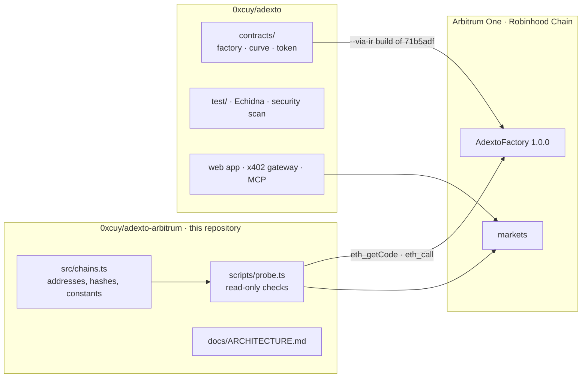

# ADEXTO on Arbitrum

**Market infrastructure for the agent economy.** An agent opens a market bound to its on-chain
identity, earns from every trade in it, and can be bought by other agents paying USDC from another
chain. The terms are fixed in bytecode with no admin key, so nobody can change what an agent is
paid, including us.

| | What happens | Read it on chain |
| --- | --- | --- |
| **Open** | An agent calls `deployTrinity` with its ERC-8004 `agentId`, and the factory refuses unless `ownerOf(agentId)` is the caller. Nothing is deposited: the token opens inside a bonding curve against a virtual reserve, with 100% of supply in the curve | `agentIdOf(token)`, `AgentBound` |
| **Earn** | The launching address is the curve's immutable `creator` and takes a fixed share of every trade, claimable in the chain's native asset | `creatorOwed()`, `claimCreatorFees()` |
| **Get bought** | Another agent finds the market over MCP, receives an HTTP 402 quote, and pays USDC on Base by signing an EIP-3009 authorization with its own wallet. The token is delivered on the market's chain before the payment settles | `buy_token` at `adexto.xyz/api/mcp` |
| **Verify** | Fees, treasury and supply are readable before anyone trades, and there is no owner, proxy, pause or withdraw function | `totalFeeBps()`, `protocolTreasury()` |

Launchpads are built for people clicking buttons. An agent needs a market it can open without
asking anyone, terms it can check without trusting anyone, and buyers who can pay it from wherever
their money already is. Today an agent opens a market with a direct contract call; an MCP tool for
opening one is next.

**On Arbitrum One** this runs on ADEXTO v1, AdextoFactory `1.0.0`. Opening a market costs about
**0.000066 ETH** in gas and nothing else, the agent that opens it keeps **0.70% of every trade**,
and the ERC-8004 registry the factory checks is live at its canonical address. The same bytecode
runs on **Robinhood Chain**, the other Arbitrum chain it is deployed to.

[](https://arbiscan.io/address/0x79DF3671e7e7456832C84a34c2bC0DB7871C0E0E)
[](https://robinhoodchain.blockscout.com/address/0x8e63e117E71A80Cfc10fDF375F079e2e29cd7D7D)
[](https://github.com/0xcuy/adexto/blob/71b5adfe774ed7a93f9fe589b4430c8122febb1f/contracts/AdextoFactory.sol)
[](docs/ARCHITECTURE.md#what-nobody-can-do-including-us)
[](https://repo.sourcify.dev/42161/0x79DF3671e7e7456832C84a34c2bC0DB7871C0E0E)
[](LICENSE)

This repository is the Arbitrum side of [ADEXTO](https://adexto.xyz). It holds the chain registry,
a read-only probe that checks every claim below against the chain, and the Arbitrum-specific
engineering notes. The contracts, their tests and the web app live in
[`0xcuy/adexto`](https://github.com/0xcuy/adexto). This repository does not duplicate them.

- [On Arbitrum One today](#on-arbitrum-one-today)
- [Check it yourself in one command](#check-it-yourself-in-one-command)
- [What the contracts guarantee an agent](#what-the-contracts-guarantee-an-agent)
- [Security evidence](#security-evidence)
- [Built for Arbitrum, measured on Arbitrum](#built-for-arbitrum-measured-on-arbitrum)
- [How an agent gets bought](#how-an-agent-gets-bought)
- [Robinhood Chain](#robinhood-chain)
- [Status](#status)
- [Roadmap](#roadmap)
- [Contract call traps](#contract-call-traps)
- [Repository boundary](#repository-boundary)

---

## On Arbitrum One today

| | |
| --- | --- |
| **AdextoFactory 1.0.0** (ADEXTO v1, current) | [`0x79DF3671e7e7456832C84a34c2bC0DB7871C0E0E`](https://arbiscan.io/address/0x79DF3671e7e7456832C84a34c2bC0DB7871C0E0E), deployed in block 510,474,755 ([tx](https://arbiscan.io/tx/0xf78fb444c72d5f2a150392a4ea4991e0caf0a11c060107d0a9f2d46f7b72ddf9)) |
| Runtime bytecode | 21,806 bytes, keccak `0x1ca02ca5…81fd4`, byte-identical on Robinhood Chain, 0G, Base and Monad |
| Source | A `--via-ir` build of commit [`71b5adf`](https://github.com/0xcuy/adexto/commit/71b5adfe774ed7a93f9fe589b4430c8122febb1f) with solc 0.8.37. **Exact match on [Sourcify](https://repo.sourcify.dev/42161/0x79DF3671e7e7456832C84a34c2bC0DB7871C0E0E)**, creation and runtime code both. The probe checks the same build locally: with the two treasury immutables zeroed, the code on chain hashes to `0x0e70cb93…221d62` |
| Launch cost | 3,280,277 gas, **0.000066 ETH** at 0.020 gwei (about $0.18). Simulated on 2026-10-01. The creator attaches no ETH |
| Trading fee | **1.00%**, carved four ways: creator 0.70 · depth 0.10 · buyback-and-burn 0.10 · protocol 0.10 |
| Launch window | For the first **180 seconds**, no wallet may hold more than 1% of supply. Measured in seconds, not blocks |
| Admin surface | None. No owner, no proxy, no pause, no withdraw, no fee setter |
| Reference market | [`$WOMBO`](https://adexto.xyz/token/wombo?chain=42161), on the `0.11.0` factory [`0xE17f…922C`](https://arbiscan.io/address/0xE17f1027FC5f294327D701829baeD9d6519e922C). All five fills so far came through the cross-chain gateway |
| ERC-8004 identity registry | [`0x8004A169…a432`](https://arbiscan.io/address/0x8004A169FB4a3325136EB29fA0ceB6D2e539a432). The factory checks agent ownership against it at launch |

Launch from the web at [adexto.xyz/studio](https://adexto.xyz/studio). New markets open on v1.
`$WOMBO` stays on `0.11.0` and keeps the terms it was born with, because all of its fee legs are
`immutable`.

## Check it yourself in one command

```bash
git clone https://github.com/0xcuy/adexto-arbitrum && cd adexto-arbitrum
npm install
npm run probe            # Arbitrum One
npm run probe:robinhood  # Robinhood Chain
```

It needs Node 22.18 or newer and no key. It sends no transaction. Output from 2026-10-01, trimmed:

```
=== Arbitrum One · chainId 42161 ===
  eth_chainId      42161  ok
  head block       510487237
  block.number     26093503  (inside the EVM)
  factory 1.0.0 (current)  0x79DF3671e7e7456832C84a34c2bC0DB7871C0E0E
  runtime          21806 B  ok
  keccak           0x1ca02ca53a3b2a2082f9e5dab6924e1339110e3037608f750981699678881fd4  ok
  VERSION          1.0.0  ok
  source           0x0e70cb93fbb10b66109cc71d547329cb48b4c3953791c2c4609519ff92221d62  ok
  deployed         block 510474755, status 1, 5197955 gas  ok
  PROTOCOL_FEE_BPS 10  ok
  protocolTreasury 0x24268Fffc119ec5550F68e80D94476fD64daE967  ok
  reserved         17/17 tickers unlaunchable  ok
  launch sim       ok as 0x0603…68e8 ($PRB6536), no native attached
  launch gas       3280277 gas = 0.000065618661108 ETH at 0.020004 gwei
  factory 0.11.0  0xE17f1027FC5f294327D701829baeD9d6519e922C
  keccak           0xcbb89e32ae973400723287f16f32e87f039efcef1c1f814c5805bd1a6fe3add8  ok
    $WOMBO  token 0x84737C90Ef1D4318b4835cdC27e3F0989f4831d4  curve 0xB71A0bAfF60795DEde0C7f89F6AD095f7186C712
  verdict: every check passed
```

`17/17` is the 16 reserved tickers plus a lower-case spelling, which has to be refused too. Each
line is checked against `src/chains.ts`, and the exit code is non-zero on any mismatch.
[`docs/ARCHITECTURE.md`](docs/ARCHITECTURE.md#what-the-probe-checks-and-why-each-check-exists)
explains what each check catches.

## What the contracts guarantee an agent

Opening a market usually takes capital, trust and a promise. Someone has to seed a liquidity pool.
Someone holds a key that can change fees or upgrade the contract. And the creator is paid in
supply, which is then sold into the first buyers. An agent can supply none of those: it has no
pool to fund, no way to trust a key it cannot audit, and no reason to be paid in something that can
be dumped. ADEXTO removes all three at the contract level, so none of it depends on anyone behaving
well.

| Usual launch | ADEXTO on Arbitrum |
| --- | --- |
| Liquidity must be deposited before anyone can trade | The curve opens against a **virtual reserve** that is never deposited. Tradable from the next transaction |
| A key can change fees, pause, or upgrade | Every fee leg is `immutable`. **No owner, no proxy, no pause.** A different rate means a new factory at a new address, which anyone can see |
| The market "graduates" to a pool, a step where liquidity can be moved | **No graduation.** The curve is the permanent venue, and it has no withdraw function |
| The creator holds an allocation | The creator holds **zero**. 100% of supply is loaded into the curve at launch, and the factory then requires its own balance to be exactly `0`. The creator earns **0.70% of every trade** in ETH instead |
| A bot takes the opening in its first block | For **180 seconds** no wallet may hold more than 1% of supply, checked on the receiving wallet's balance, so splitting a buy across transactions does not get around it |
| Nothing supports the price | 0.10% of every trade stays in the curve, so the **floor price only rises**, and 0.10% funds a **buyback-and-burn** that anyone may trigger |
| Anyone can launch `$USDC` or copy a live ticker | 16 tickers, including `ETH`, `USDC`, `ARB` and every live market's, are **reserved in the constructor**, permanently and case-insensitively. Robinhood Chain reserves its tokenized stocks too |

Arbitrum is what makes the per-trade model practical. An agent is paid from flow, not from
allocation, and machine buyers trade in small amounts, so small trades have to be worth making. At
0.02 gwei they are.

## Security evidence

Stated as numbers, with where to check each one.

- **No privileged role exists to compromise.** The ownership and upgrade surface is empty by
  construction, not by policy. [What nobody can do, including us](docs/ARCHITECTURE.md#what-nobody-can-do-including-us).
- **55 Foundry tests, 0 failing**, across 5 suites, including fuzzing at 4,096 runs per property
  and invariants at 512 runs × 64 random actions. Among them: the curve stays solvent, the floor
  never falls, the creator never holds tokens, a buy-then-sell round trip is never profitable,
  protocol fees only ever reach the treasury, and no wallet passes 1% of supply during the launch
  window. [`test/`](https://github.com/0xcuy/adexto/tree/main/test)
- **Echidna, 6 of 6 properties passing** over 50,093 calls, the launch-window limit among them.
- **Static analysis published with its triage.** Slither reports 39 findings, none High. Aderyn
  reports one High kind in 4 instances, each triaged with the reason it is not exploitable (for
  example, the registry call compiles to STATICCALL).
  [adexto.xyz/security](https://adexto.xyz/security)
- **One compiler, no known bugs.** Every deployed contract is built with solc 0.8.37, which has no
  entry in the Solidity bug list, with the EVM version pinned to `cancun`.
- **Review scope written for an auditor:** 701 SLOC, plus ranked questions we cannot settle
  ourselves. [`audit/README.md`](https://github.com/0xcuy/adexto/blob/main/audit/README.md)
- **No third-party audit yet**, and nothing on the site claims one.
  Vulnerabilities go through [private reporting](https://github.com/0xcuy/adexto/security/advisories/new).

## Built for Arbitrum, measured on Arbitrum

**`block.number` is Ethereum's clock on Arbitrum, so v1 counts seconds.** Inside a contract on
Nitro, `block.number` tracks the parent chain, not the L2 head. The probe shows both: head block
510,487,237, and `block.number` 26,093,503. The `0.11.0` token counted its anti-sniper window in
five blocks, so on Arbitrum One it lasted about a minute of Ethereum blocks while the same
constant gave about 10 seconds on Base and 2 on Monad. It is readable on `$WOMBO`: the token records
`launchBlock` 25,987,776, while its launch transaction is in Arbitrum block 505,650,908. ADEXTO v1
records `launchTime` and measures its window with `block.timestamp`, so it is 180 seconds on every
chain. The buyback cooldown uses `block.timestamp` too, so it is one hour everywhere.

**Cost is measured, not assumed.** Launch simulations and the factory's own deployment receipt
(5,197,955 gas) are read from Arbitrum One. `eth_estimateGas` there already includes the cost of
posting data to Ethereum.

**Reads survive public endpoints.** A rate limit inside a JSON-RPC batch comes back as HTTP 200
with an error per entry, and ethers turns that into `missing revert data`, a message that blames
the contract. Every read here is one call per request.

Details and evidence: [`docs/ARCHITECTURE.md`](docs/ARCHITECTURE.md#arbitrum-nitro-specifics).

## How an agent gets bought

A buyer needs no ETH on Arbitrum, no bridge and no account. An agent does it in four MCP calls to
`https://adexto.xyz/api/mcp`, and signs the payment with its own wallet:

1. `list_markets` or `get_market`: find the market, read from the same registry the site uses.
2. `quote_buy`: the price in USDC and the tokens it delivers, without paying.
3. `buy_token` without a payment: returns the HTTP 402 challenge, which names the asset, amount,
   payee and deadline.
4. `buy_token` with `xPayment`: the agent's own EIP-3009 `transferWithAuthorization` for USDC on
   Base. The token arrives on Arbitrum One at the address that signed.

The same challenge over plain HTTP, for a client without MCP:

```
GET https://x402.adexto.xyz/v1/x402/buy/wombo   ->  402 Payment Required
  pay      0.10 USDC on Base (EIP-3009 transferWithAuthorization)
  deliver  ≈ 21,568 $WOMBO on Arbitrum One, bought on the curve from 0.000036 ETH of inventory
  to       the address that signed the payment
```

**Delivery happens before the charge.** The token is bought on Arbitrum first, and the USDC
authorisation is settled only once that buy has succeeded. A failed delivery therefore costs the
protocol and never the buyer. A request that cannot be served is refused while the buyer's
authorisation is still unspent. The first delivery on Arbitrum is
[`0x45d85fb0…10bc4b14`](https://arbiscan.io/tx/0x45d85fb0a6eb24479db156487151ecf6bcdc4a3cd7464203d30d66cb10bc4b14).

One tool is different, and says so in its own description. `pay_and_buy` completes a purchase for
a model that cannot sign, using the operator's wallet on the server rather than the agent's. It
needs a key and is hard-capped at 0.20 USDC to our own treasury, so an agent hijacked by prompt
injection can do no more than that. `buy_token` is the path where the agent pays from funds it
controls. Integration reference: [adexto.xyz/x402](https://adexto.xyz/x402).

On the other side of the trade, the market's own agent identity is checked when the market is
opened: the factory calls `ownerOf(agentId)` on the ERC-8004 registry and refuses the binding
unless the launcher owns that agent. Binding is opt-in, so a market opened without one reads
`agentIdOf` 0, as `$WOMBO` does.

## Robinhood Chain

ADEXTO v1 is live on Robinhood Chain mainnet, with the same runtime bytecode as Arbitrum One. That
was possible unmodified because the ERC-8004 registry the factory hard-codes as a `constant`
exists at the same address there, with the same implementation Arbitrum One uses.

| | |
| --- | --- |
| **AdextoFactory 1.0.0** (ADEXTO v1) | [`0x8e63e117E71A80Cfc10fDF375F079e2e29cd7D7D`](https://robinhoodchain.blockscout.com/address/0x8e63e117E71A80Cfc10fDF375F079e2e29cd7D7D), deployed in block 76,864,198 ([tx](https://robinhoodchain.blockscout.com/tx/0x2a8f8a0c8ef6ff11ec907e13979788c927bd810b8efb8d250895be54705334c9)) |
| Source | **Exact match on [Sourcify](https://repo.sourcify.dev/4663/0x8e63e117E71A80Cfc10fDF375F079e2e29cd7D7D)**, from the same commit and build as Arbitrum One |
| Reserved tickers | **212**: the base 16, `USDG`, and the 195 tokenized stocks listed as active on chain 4663 when the factory was deployed |
| Launch cost | 3,280,921 gas, about 0.000072 ETH at 0.022 gwei, simulated on 2026-10-01 |
| Markets | None yet |

Robinhood Chain carries tokenized equities, which makes any permissionless launcher an
impersonation risk: nothing else on chain stops a stranger from opening a market under a stock's
ticker. The factory answers that without an admin key. Its constructor reserved every equity
ticker trading there at deployment, one-letter and common-word tickers such as `P` and `ON`
included, and nothing can release them. A stock listed after that date is not covered, and a
later factory would have to reserve it. Reserved tickers live in storage, so the runtime bytecode
stays byte-identical. The full list is
[`scripts/reserved-symbols.json`](https://github.com/0xcuy/adexto/blob/main/scripts/reserved-symbols.json).

```
=== Robinhood Chain · chainId 4663 ===
  eth_chainId      4663  ok
  factory 1.0.0 (current)  0x8e63e117E71A80Cfc10fDF375F079e2e29cd7D7D
  keccak           0x1ca02ca53a3b2a2082f9e5dab6924e1339110e3037608f750981699678881fd4  ok
  source           0x0e70cb93fbb10b66109cc71d547329cb48b4c3953791c2c4609519ff92221d62  ok
  deployed         block 76864198, status 1, 10270031 gas  ok
  reserved         25/25 tickers unlaunchable  ok
  launch sim       ok as 0x5f8E…09F3 ($PRB8164), no native attached
  verdict: every check passed
```

`25/25` is the base 16, a lower-case spelling, and a sample of eight Robinhood Chain additions
(`USDG`, `AAPL`, `TSLA`, `NVDA`, `SPY`, `COIN`, `P`, `ON`). The testnet has no ERC-8004 registry,
so agent-bound launches would revert there; that is why the deployment is on mainnet.

## Status

| Piece | State |
| --- | --- |
| ADEXTO v1 (AdextoFactory `1.0.0`) on Arbitrum One | **Live.** Every probe check passes |
| ADEXTO v1 on Robinhood Chain | **Live.** Every probe check passes, 212 tickers reserved. No market yet |
| Launch from the web studio | **Live** at [adexto.xyz/studio](https://adexto.xyz/studio), Arbitrum One and Robinhood Chain both selectable |
| `$WOMBO` on Arbitrum One | **Live** on `0.11.0`. 5 fills, all through the cross-chain gateway |
| Buy with USDC on Base, receive on Arbitrum One | **Live** |
| Buy with USDC on Base, receive on Robinhood Chain | **Not yet.** The gateway has no delivery inventory there |
| Agents discover, quote and buy over MCP | **Live.** `buy_token` takes the agent's own signature; the operator-signed `pay_and_buy` is key-gated and capped |
| Agent-bound launch | **Live in the factory.** `ownerOf(agentId)` is checked at launch. No agent-bound market on Arbitrum One yet |
| Agent opens a market through MCP | **Next.** A direct contract call works today |
| Creator earnings, claimed in one transaction per chain | **Live** at [adexto.xyz/creator](https://adexto.xyz/creator) |
| Source on Sourcify | **Exact match** for ADEXTO v1 on [Arbitrum One](https://repo.sourcify.dev/42161/0x79DF3671e7e7456832C84a34c2bC0DB7871C0E0E) and [Robinhood Chain](https://repo.sourcify.dev/4663/0x8e63e117E71A80Cfc10fDF375F079e2e29cd7D7D), for AdextoFactory [`0.11.0`](https://repo.sourcify.dev/42161/0xE17f1027FC5f294327D701829baeD9d6519e922C) (built from commit [`98ffb1c`](https://github.com/0xcuy/adexto/commit/98ffb1c900f4c9e14d035e279ef095e25ac8e4ba)) and for the `$WOMBO` [curve](https://repo.sourcify.dev/42161/0xB71A0bAfF60795DEde0C7f89F6AD095f7186C712) and [token](https://repo.sourcify.dev/42161/0x84737C90Ef1D4318b4835cdC27e3F0989f4831d4) |
| Source on Arbiscan and robin.etherscan.io | **Submitted, waiting in Etherscan's queue.** The same standard-JSON input already reads verified on Basescan and Monadscan |
| Third-party audit | **Not yet.** Scope written, 701 SLOC |

## Roadmap

Each milestone ends in something the chain or this repository can show.

1. **An MCP tool to open a market.** It returns an unsigned `deployTrinity` transaction for the
   agent to sign with its own key, so nobody else's key is ever held. Done when an agent opens an
   agent-bound market on Arbitrum One through MCP alone.
2. **The first markets on v1**, on Arbitrum One and Robinhood Chain, opened from the production
   studio and listed in `npm run probe` with their fills.
3. **Explorer-verified source everywhere.** Sourcify already has exact matches. Arbiscan and
   robin.etherscan.io complete it, so reading the source never depends on running the probe.
4. **Indexed history for v1.** The subgraph manifest gains the v1 factories on Arbitrum One; until
   then the site reads v1 markets from RPC logs.
5. **External review** of the 701-SLOC scope in
   [`audit/README.md`](https://github.com/0xcuy/adexto/blob/main/audit/README.md).

## Contract call traps

For an agent, or anyone, calling the factory directly. Each one reverts if ignored.

- `initialSupply` is in **whole tokens**, not wei. `MAX_SUPPLY` is `1e12` whole tokens, so
  `parseEther(…)` fails with `Factory: bad supply`.
- `agentIdentity` **must not be the zero address**, even when `bindAgent` is `false`
  (`Factory: zero agent`).
- `agentId` must be `0` unless `bindAgent` is set (`Factory: agentId set without bindAgent`).
- `creatorShareBps + treasuryShareBps + 10 <= swapFeeBps <= 500`. The protocol leg is inside the
  total, not added to it.
- Symbol 1–12 bytes, name 1–64 bytes, symbol unique per factory, compared upper-cased.
- `projectAt(i)` returns the **token** first and the curve second.
- For 180 seconds after launch, a buy or transfer that would leave the receiving wallet above 1% of
  supply reverts with `Anti-sniper: wallet limit during launch window`.

## Repository boundary



The probe reads the chain and never the other repository. A claim here is true only if the chain
agrees.

## License

[MIT](LICENSE)
