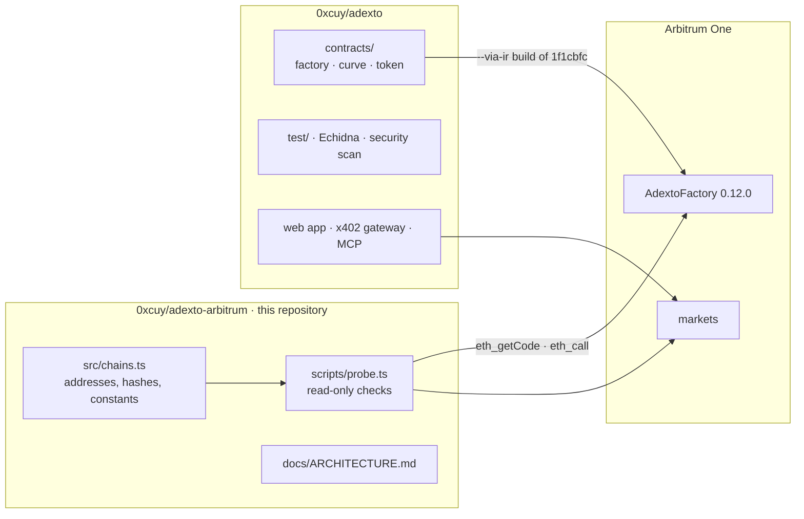

# ADEXTO on Arbitrum

**On Arbitrum One, launching a token opens its market in the same transaction.** The market is a
bonding curve with no liquidity deposit. Its fees are fixed in bytecode, and there is no owner,
admin key, proxy or withdraw function. A launch costs about **0.000065 ETH** in gas and nothing
else.

[](https://arbiscan.io/address/0x75EeDEd196D2BE283d815D52F617eB70bCe865bC)
[](https://github.com/0xcuy/adexto/blob/1f1cbfc5ce97b417aa926e122e564738d4389e55/contracts/AdextoFactory.sol)
[](docs/ARCHITECTURE.md#what-nobody-can-do-including-us)
[](LICENSE)

This repository is the Arbitrum side of [ADEXTO](https://adexto.xyz). It holds the chain registry,
a read-only probe that checks every claim below against the chain, and the Arbitrum-specific
engineering notes. The contracts, their tests and the web app live in
[`0xcuy/adexto`](https://github.com/0xcuy/adexto). This repository does not duplicate them.

- [On Arbitrum One today](#on-arbitrum-one-today)
- [Check it yourself in one command](#check-it-yourself-in-one-command)
- [The problem, and what the contracts do about it](#the-problem-and-what-the-contracts-do-about-it)
- [Security evidence](#security-evidence)
- [Built for Arbitrum, measured on Arbitrum](#built-for-arbitrum-measured-on-arbitrum)
- [Buying from another chain, and buying as an agent](#buying-from-another-chain-and-buying-as-an-agent)
- [Robinhood Chain](#robinhood-chain)
- [Status](#status)
- [Roadmap](#roadmap)
- [Contract call traps](#contract-call-traps)
- [Repository boundary](#repository-boundary)

---

## On Arbitrum One today

| | |
| --- | --- |
| **AdextoFactory 0.12.0** (current) | [`0x75EeDEd196D2BE283d815D52F617eB70bCe865bC`](https://arbiscan.io/address/0x75EeDEd196D2BE283d815D52F617eB70bCe865bC), deployed in block 509,845,969 ([tx](https://arbiscan.io/tx/0x9084a9ae5d7a765563ff2c935980053fa11a6ff87fc114bc8c3c9bb35cec35f5)) |
| Runtime bytecode | 21,403 bytes, keccak `0xc0841d5a…174d8f0f`, byte-identical on 0G, Base and Monad |
| Source | A `--via-ir` build of commit [`1f1cbfc`](https://github.com/0xcuy/adexto/commit/1f1cbfc5ce97b417aa926e122e564738d4389e55). The probe checks it: with the two treasury immutables zeroed, the code on chain hashes to `0x83adf272…3dac3f` |
| Launch cost | 3,255,560 gas, **0.000065 ETH** at 0.020 gwei (about $0.18). Simulated on 2026-09-30. The creator attaches no ETH |
| Trading fee | **1.00%**, carved four ways: creator 0.70 · depth 0.10 · buyback-and-burn 0.10 · protocol 0.10 |
| Admin surface | None. No owner, no proxy, no pause, no withdraw, no fee setter |
| Reference market | [`$WOMBO`](https://adexto.xyz/token/wombo?chain=42161), on the `0.11.0` factory [`0xE17f…922C`](https://arbiscan.io/address/0xE17f1027FC5f294327D701829baeD9d6519e922C). All five fills so far came through the cross-chain gateway |
| ERC-8004 identity registry | [`0x8004A169…a432`](https://arbiscan.io/address/0x8004A169FB4a3325136EB29fA0ceB6D2e539a432). The factory checks agent ownership against it at launch |

Launch from the web at [adexto.xyz/studio](https://adexto.xyz/studio). New markets open on
`0.12.0`. Older generations stay deployed and reachable, and every market keeps the terms it was
born with, because all of its fee legs are `immutable`.

## Check it yourself in one command

```bash
git clone https://github.com/0xcuy/adexto-arbitrum && cd adexto-arbitrum
npm install
npm run probe            # Arbitrum One
npm run probe:robinhood  # Robinhood Chain readiness
```

It needs Node 22.18 or newer and no key. It sends no transaction. Output from 2026-09-30, trimmed:

```
=== Arbitrum One · chainId 42161 ===
  eth_chainId      42161  ok
  head block       510404032
  block.number     26091580  (inside the EVM)
  factory 0.12.0 (current)  0x75EeDEd196D2BE283d815D52F617eB70bCe865bC
  runtime          21403 B  ok
  keccak           0xc0841d5a2193f21df6b7f685bbe39fd5ee6411cbf89bf76e1b99d867174d8f0f  ok
  VERSION          0.12.0  ok
  source           0x83adf2725ca03af986bf18a15a4b675eeba4e288b0515bbd370342d1de3dac3f  ok
  deployed         block 509845969, status 1, 6042220 gas  ok
  PROTOCOL_FEE_BPS 10  ok
  protocolTreasury 0x24268Fffc119ec5550F68e80D94476fD64daE967  ok
  reserved         17/17 tickers unlaunchable  ok
  launch sim       ok as 0x3DF2…2304 ($PRB2831), no native attached
  launch gas       3255560 gas = 0.00006513073336 ETH at 0.020006 gwei
  verdict: every check passed
```

`17/17` is the 16 reserved tickers plus a lower-case spelling, which has to be refused too. Each
line is checked against `src/chains.ts`, and the exit code is non-zero on any mismatch.
[`docs/ARCHITECTURE.md`](docs/ARCHITECTURE.md#what-the-probe-checks-and-why-each-check-exists)
explains what each check catches.

## The problem, and what the contracts do about it

Opening a market for a new token usually takes capital, trust and a promise. Someone has to seed
a liquidity pool. Someone holds a key that can change fees or upgrade the contract. And the
creator is paid in supply, which is then sold into the first buyers. ADEXTO removes all three at
the contract level, so none of it depends on anyone behaving well.

| Usual launch | ADEXTO on Arbitrum |
| --- | --- |
| Liquidity must be deposited before anyone can trade | The curve opens against a **virtual reserve** that is never deposited. Tradable from the next transaction |
| A key can change fees, pause, or upgrade | Every fee leg is `immutable`. **No owner, no proxy, no pause.** A different rate means a new factory at a new address, which anyone can see |
| The market "graduates" to a pool, a step where liquidity can be moved | **No graduation.** The curve is the permanent venue, and it has no withdraw function |
| The creator holds an allocation | The creator holds **zero**. 100% of supply is loaded into the curve at launch, and the factory then requires its own balance to be exactly `0`. The creator earns **0.70% of every trade** in ETH instead |
| Nothing supports the price | 0.10% of every trade stays in the curve, so the **floor price only rises**, and 0.10% funds a **buyback-and-burn** that anyone may trigger |
| Anyone can launch `$USDC` or copy a live ticker | 16 tickers, including `ETH`, `USDC`, `ARB` and every live market's, are **reserved in the constructor**, permanently and case-insensitively |

Arbitrum is what makes the per-trade model practical. A creator is paid from flow, not from
allocation, so small trades have to be worth making. At 0.02 gwei they are.

## Security evidence

Stated as numbers, with where to check each one.

- **No privileged role exists to compromise.** The ownership and upgrade surface is empty by
  construction, not by policy. [What nobody can do, including us](docs/ARCHITECTURE.md#what-nobody-can-do-including-us).
- **55 Foundry tests, 0 failing**, across 6 suites, including fuzzing at 4,096 runs per property
  and invariants at 512 runs × 64 random actions. Among them: the curve stays solvent, the floor
  never falls, the creator never holds tokens, a buy-then-sell round trip is never profitable, and
  protocol fees only ever reach the treasury. [`test/`](https://github.com/0xcuy/adexto/tree/main/test)
- **Echidna, 9 of 9 properties passing** over 100,219 calls across two harnesses. One of them
  launches through the `0.12.0` factory with the production fee split.
- **Static analysis published with its triage.** Slither reports 67 findings, none High. Aderyn
  reports one High kind in 8 instances, each triaged with the reason it is not exploitable (for
  example, the registry call compiles to STATICCALL).
  [adexto.xyz/security](https://adexto.xyz/security)
- **Review scope written for an auditor:** 694 SLOC, plus ten ranked questions we cannot settle
  ourselves. [`audit/README.md`](https://github.com/0xcuy/adexto/blob/main/audit/README.md)
- **No third-party audit yet**, and nothing on the site claims one.
  Vulnerabilities go through [private reporting](https://github.com/0xcuy/adexto/security/advisories/new).

## Built for Arbitrum, measured on Arbitrum

**`block.number` is Ethereum's clock on Arbitrum.** Inside a contract on Nitro, `block.number`
tracks the parent chain, not the L2 head. The probe shows both: head block 510,404,032, and
`block.number` 26,091,580. The token's anti-sniper cap applies for five blocks after launch, so on
Arbitrum One it lasts about a minute of Ethereum blocks rather than a few seconds. It is readable
on `$WOMBO`: the token records `launchBlock` 25,987,776, while its launch transaction is in
Arbitrum block 505,650,908. The buyback cooldown uses `block.timestamp`, so it is one hour
everywhere.

**Cost is measured, not assumed.** Launch simulations and the factory's own deployment receipt
(6,042,220 gas) are read from Arbitrum One. `eth_estimateGas` there already includes the cost of
posting data to Ethereum.

**Reads survive public endpoints.** A rate limit inside a JSON-RPC batch comes back as HTTP 200
with an error per entry, and ethers turns that into `missing revert data`, a message that blames
the contract. Every read here is one call per request.

Details and evidence: [`docs/ARCHITECTURE.md`](docs/ARCHITECTURE.md#arbitrum-nitro-specifics).

## Buying from another chain, and buying as an agent

A buyer does not need ETH on Arbitrum to buy an Arbitrum market. The x402 gateway quotes a
purchase payable with USDC on Base and delivers the token on Arbitrum One. The request is:

```
GET https://x402.adexto.xyz/v1/x402/buy/wombo   ->  402 Payment Required
  pay      0.10 USDC on Base (EIP-3009 transferWithAuthorization)
  deliver  ≈ 21,568 $WOMBO on Arbitrum One, bought on the curve from 0.000036 ETH of inventory
  to       the address that signed the payment
```

**Delivery happens before the charge.** The token is bought on Arbitrum first, and the USDC
authorisation is settled only once that buy has succeeded. A failed delivery therefore costs the
protocol and never the buyer. A request that cannot be served is refused while the buyer's
authorisation is still unspent. The first delivery on Arbitrum is
[`0x45d85fb0…10bc4b14`](https://arbiscan.io/tx/0x45d85fb0a6eb24479db156487151ecf6bcdc4a3cd7464203d30d66cb10bc4b14).

Agents get the same market through an MCP server at `https://adexto.xyz/api/mcp`:
`list_markets`, `get_market`, `quote_buy`, `how_to_pay`, `buy_token` and `trade_history` are
free. `pay_and_buy` executes a purchase end to end. It needs a key, is signed by the operator's
wallet rather than the agent's, and is hard-capped at 0.20 USDC to our own treasury, so an agent
hijacked by prompt injection can do no more than that. Integration reference:
[adexto.xyz/x402](https://adexto.xyz/x402).

A launch can bind an ERC-8004 agent identity. The factory calls `ownerOf(agentId)` on the
registry and refuses the binding unless the launcher owns that agent. Binding is opt-in, so a
market without an agent reads `agentIdOf` 0.

## Robinhood Chain

Robinhood Chain is the next deployment, and the current bytecode can go there unmodified. That
was checked before planning it rather than assumed. The factory hard-codes the ERC-8004 registry
as a `constant`, so the registry has to exist at that exact address:

```
=== Robinhood Chain · chainId 4663 ===
  eth_chainId      4663  ok
  block.number     26091583  (inside the EVM)
  ERC-8004         0x8004A169FB4a3325136EB29fA0ceB6D2e539a432  130 B, implementation 0x7274e874CA62410a93Bd8bf61c69d8045E399c02
  readiness for a byte-identical deployment: READY (registry present at the hard-coded address)
```

The registry implementation is the same one Arbitrum One uses. On Robinhood Chain Testnet the
registry is absent, so agent-bound launches would revert there. That makes mainnet the target.
At Arbitrum One's deployment gas and Robinhood Chain's current gas price, deploying costs about
0.00014 ETH.

Robinhood Chain carries tokenized equities, which makes any permissionless launcher an
impersonation risk: nothing on chain stops a stranger from opening a market under a stock's
ticker. The factory already has an answer that needs no admin key. The Robinhood Chain deployment
will reserve the tickers of the equity tokens that trade there in its constructor, permanently.
Reserved tickers live in storage, so the runtime bytecode stays byte-identical.

## Status

| Piece | State |
| --- | --- |
| AdextoFactory `0.12.0` on Arbitrum One | **Live.** Every probe check passes |
| Launch from the web studio | **Live** at [adexto.xyz/studio](https://adexto.xyz/studio) |
| `$WOMBO` on Arbitrum One | **Live** on `0.11.0`. 5 fills, all through the cross-chain gateway |
| Buy with USDC on Base, receive on Arbitrum One | **Live** |
| MCP server for agents | **Live.** The paying tool is key-gated and capped |
| Creator earnings, claimed in one transaction per chain | **Live** at [adexto.xyz/creator](https://adexto.xyz/creator) |
| Robinhood Chain | **Next.** Readiness checked, nothing deployed yet |
| Source verification on Arbiscan and Sourcify | **Not yet.** Verified today by reproducible build, as the probe shows |
| Third-party audit | **Not yet.** Scope written, 694 SLOC |

## Roadmap

Each milestone ends in something the chain or this repository can show.

1. **Robinhood Chain mainnet.** Deploy AdextoFactory `0.12.0` byte-identical, with the tickers of
   tokenized equities reserved at construction. Done when `npm run probe:robinhood` lists the
   factory and passes.
2. **Explorer-verified source.** Verify every Arbitrum One generation on Arbiscan and Sourcify, so
   the source match does not depend on running the probe.
3. **Markets on `0.12.0`.** Open markets on the current factory on Arbitrum One from the production
   studio, with their full history indexed.
4. **External review** of the 694-SLOC scope in
   [`audit/README.md`](https://github.com/0xcuy/adexto/blob/main/audit/README.md).

## Contract call traps

For anyone calling the factory directly. Each one reverts if ignored.

- `initialSupply` is in **whole tokens**, not wei. `MAX_SUPPLY` is `1e12` whole tokens, so
  `parseEther(…)` fails with `Factory: bad supply`.
- `agentIdentity` **must not be the zero address**, even when `bindAgent` is `false`
  (`Factory: zero agent`).
- `agentId` must be `0` unless `bindAgent` is set (`Factory: agentId set without bindAgent`).
- `creatorShareBps + treasuryShareBps + 10 <= swapFeeBps <= 500`. The protocol leg is inside the
  total, not added to it.
- Symbol 1–12 bytes, name 1–64 bytes, symbol unique per factory, compared upper-cased.
- `projectAt(i)` returns the **token** first and the curve second.

## Repository boundary



The probe reads the chain and never the other repository. A claim here is true only if the chain
agrees.

## License

[MIT](LICENSE)
