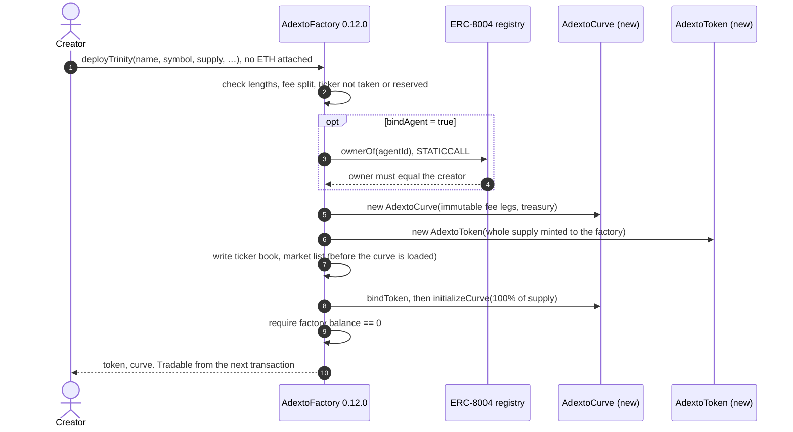
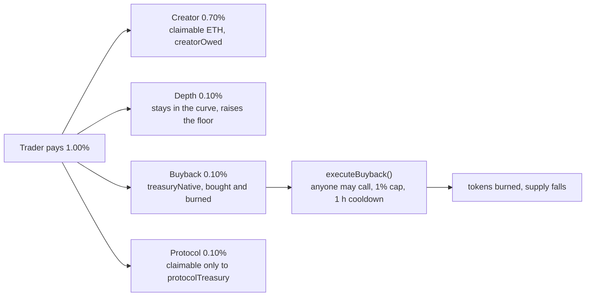

# Architecture

More detail than the README. This document explains why each piece is shaped the way it is on
Arbitrum, and which of those choices can be checked from the chain. Where a claim can be
checked, the command or the read that checks it is given next to it.

- [The three contracts](#the-three-contracts)
- [One launch, one transaction](#one-launch-one-transaction)
- [Where a trader's fee goes](#where-a-traders-fee-goes)
- [What nobody can do, including us](#what-nobody-can-do-including-us)
- [Arbitrum Nitro specifics](#arbitrum-nitro-specifics)
- [What the probe checks, and why each check exists](#what-the-probe-checks-and-why-each-check-exists)
- [Deploying the same bytecode to another Arbitrum chain](#deploying-the-same-bytecode-to-another-arbitrum-chain)
- [Known limits](#known-limits)

---

## The three contracts

Source links are pinned to commit `1f1cbfc`, the build that matches the `0.12.0` bytecode on
chain (see [what the probe checks](#what-the-probe-checks-and-why-each-check-exists)).

| Contract | Role | Deployed as |
| --- | --- | --- |
| [`AdextoFactory.sol`](https://github.com/0xcuy/adexto/blob/1f1cbfc5ce97b417aa926e122e564738d4389e55/contracts/AdextoFactory.sol) | Deploys a token and its curve together; keeps the ticker book | One per chain per generation |
| [`AdextoCurve.sol`](https://github.com/0xcuy/adexto/blob/1f1cbfc5ce97b417aa926e122e564738d4389e55/contracts/AdextoCurve.sol) | The market: buy, sell, fee legs, buyback-and-burn | One per launch, created by the factory |
| [`AdextoToken.sol`](https://github.com/0xcuy/adexto/blob/1f1cbfc5ce97b417aa926e122e564738d4389e55/contracts/AdextoToken.sol) | Plain ERC-20, fixed supply, short anti-sniper window | One per launch, created by the factory |
| [`IIdentityRegistry.sol`](https://github.com/0xcuy/adexto/blob/1f1cbfc5ce97b417aa926e122e564738d4389e55/contracts/IIdentityRegistry.sol) | `view` interface for the ERC-8004 ownership check | Interface only |

The factory's runtime bytecode embeds the creation code of the curve and the token, so one
bytecode comparison against the factory covers all three.

## One launch, one transaction



Three details carry the design.

**No ETH is attached.** `deployTrinity` is not `payable`. The curve opens against a virtual
reserve (`virtualNative`), which sets the opening price and is never deposited, so a launch costs
the creator gas and nothing else. Measured by simulation on 2026-09-30: 3,255,560 gas, which at
0.020 gwei is 0.000065 ETH.

**The creator receives no tokens.** 100% of supply goes into the curve inside the same
transaction, and the factory then requires its own balance to be exactly zero. A strict equality
is deliberate: it is the on-chain proof that nobody, the creator included, holds an allocation to
sell into the first buyers. The creator is paid from trading instead (next section).

**The ticker is claimed before the curve is loaded.** The ticker book and market list are written
before `bindToken` and `initializeCurve`, the two calls that move supply, so a reentrant attempt
to launch the same ticker fails the check that has already been written.

## Where a trader's fee goes

`0.12.0` charges one number, 1.00%, and splits it four ways. `swapFeeBps` is the whole fee; depth
is the remainder after the three named legs, so the four always sum to what the trader was quoted.



- **Depth** is retained by the curve, so the floor price, `(virtualNative + totalDepthFeesRetained) / curveTokens`,
  can only rise. `invariant_floorNeverFalls` checks it.
- **Buyback** accrues in `treasuryNative`, which only the curve's own fee leg can fill. Spending it
  is permissionless, capped at 1% of reserve per call, and since `0.12.0` limited to one call per
  hour (`BUYBACK_COOLDOWN = 3600`), so it cannot be looped inside one transaction.
- **Protocol** accrues in `protocolOwed` and can be claimed only to `protocolTreasury`, an
  immutable. The rate is the factory constant `PROTOCOL_FEE_BPS = 10`, readable before anyone
  trades.

In `0.11.0`, the generation `$WOMBO` runs on, the protocol leg was added on top of the configured
fee rather than carved out of it. Every leg is `immutable`, so each market keeps the terms it was
born with, permanently.

## What nobody can do, including us

| Could anyone… | Why not |
| --- | --- |
| Change a live market's fees | Every fee leg is `immutable` in the curve. No setter, no proxy, no owner |
| Redirect protocol revenue | `protocolTreasury` is `immutable` in the factory and in every curve |
| Mint more supply | `_mint` runs once, in the token constructor |
| Pull the market's reserve | The curve has no withdraw function; native leaves only to sellers and fee claimants |
| Pause trading | There is no pause |
| Launch `$ETH`, `$USDC`, `$ARB` or an existing market's ticker on this factory | 16 tickers are reserved in the constructor and there is no function that releases one |
| Attach someone else's agent identity to a launch | The factory requires `ownerOf(agentId) == msg.sender` on the ERC-8004 registry |
| Re-enter the launch through the registry | `ownerOf` is declared `view`, so it compiles to STATICCALL and cannot change state |

The price of this is that nothing can be patched in place. A fix ships as a new factory generation
at a new address, and the markets that exist keep the code they were born with. That trade is
stated in [known limits](#known-limits) rather than hidden.

## Arbitrum Nitro specifics

### `block.number` is the parent chain's clock

On Arbitrum Nitro, `block.number` inside a contract returns an approximation of the parent
chain's block number, not the L2 block number. The L2 number is available from
`ArbSys(0x64).arbBlockNumber()`. The probe shows both side by side:

```
head block       510404032     the RPC's L2 head
block.number     26091580      what a contract sees, an Ethereum block number
```

It matters here because `AdextoToken` caps transaction size for `ANTI_SNIPE_BLOCKS = 5` blocks
after launch, counted with `block.number`. On Arbitrum One that is five Ethereum blocks, roughly
one minute, where the same constant would be about ten seconds on a chain with two-second blocks.
It is visible on chain: `$WOMBO`'s token records `launchBlock` 25,987,776, while its launch
transaction sits in Arbitrum block 505,650,908.

Robinhood Chain settles to Ethereum too, and its `block.number` reads the same clock: 26,091,583,
read minutes after Arbitrum One read 26,091,580.

The buyback cooldown uses `block.timestamp`, so it is one hour on every chain.

### Gas

`eth_estimateGas` on Arbitrum includes the cost of posting the transaction's data to the parent
chain, expressed in L2 gas units, so the launch figures in this repository already contain it.
The `0.12.0` factory itself took 6,042,220 gas to deploy.

### Reading the chain reliably

Two public-endpoint behaviours cost real time and are handled in the probe:

- Some endpoints rate-limit inside a JSON-RPC batch: the batch returns HTTP 200 with an error per
  entry, which ethers reports as `missing revert data`, a message that blames the contract. The
  probe sends one call per request (`batchMaxCount: 1`).
- Some endpoints answer `eth_call` and `eth_estimateGas` but refuse older receipts. Broadcasting
  scripts use `arb1.arbitrum.io`, which serves both.

## What the probe checks, and why each check exists

`npm run probe` never signs anything. Each check below exists because the failure it catches is
silent otherwise.

| Check | Catches |
| --- | --- |
| `eth_chainId` against the configured id | An endpoint that answers for a different chain. Asked of the node, because a static network config answers from memory and cannot fail |
| Runtime size and keccak per factory | A wrong or stale address. Size alone is not evidence of sameness: one added comment line changes the keccak and leaves the length unchanged |
| Source match | The claim that the code on chain is a build of the published source. The two `protocolTreasury` immutables are zeroed and the result must hash to `0x83adf272…3dac3f`, which a `--via-ir` build of commit `1f1cbfc` produces |
| Deployment receipt | That the address really came from the recorded transaction and block |
| Constants | Fee, supply cap, anti-sniper cap, registry, reserved sentinel and treasury, each against the value this documentation states |
| Reserved tickers | All 16, plus a lower-case spelling, must be unlaunchable |
| Launch simulation | That a random address, with no ETH attached, can open a market right now under the site's fee model |
| Market reads | What each market has done: swaps, volume, buyback vault, burned supply |

## Deploying the same bytecode to another Arbitrum chain

The factory takes two constructor arguments: the treasury, and the list of tickers to reserve.
Reserved tickers live in storage, not in the runtime code, and the treasury is the same address
everywhere, so a deployment elsewhere is byte-identical at runtime while its reserved list can be
chosen for that chain.

One precondition cannot be chosen: the ERC-8004 registry is a `constant` at
`0x8004A169FB4a3325136EB29fA0ceB6D2e539a432`. Checked with `node scripts/probe.ts robinhood` and
`robinhood-testnet`:

| Chain | Registry at the hard-coded address | Implementation |
| --- | --- | --- |
| Arbitrum One · 42161 | present, 130 B proxy | `0x7274e874CA62410a93Bd8bf61c69d8045E399c02` |
| Robinhood Chain · 4663 | present, 130 B proxy | `0x7274e874CA62410a93Bd8bf61c69d8045E399c02`, the same |
| Robinhood Chain Testnet · 46630 | absent | agent-bound launches would revert |

So Robinhood Chain mainnet can run the current factory unmodified, with agent binding working, and
its testnet can run it only without agent binding. At the factory's Arbitrum One deployment gas
and Robinhood Chain's gas price of 0.022 gwei on 2026-09-30, a deployment would cost about
0.00014 ETH.

Robinhood Chain carries tokenized equities, which makes a permissionless launcher an impersonation
vector there: nothing on chain stops a stranger from opening a market under a stock's ticker. The
constructor list is the answer that needs no admin key. A deployment there should reserve the
tickers of the equity tokens that trade on that chain, at construction, permanently.

## Known limits

- **Nothing can be patched in place.** That is the cost of having no owner. A finding in `0.12.0`
  becomes a fix in the next generation, and existing markets keep their code.
- **`0.11.0` markets, `$WOMBO` among them, have no buyback cooldown.** Their `executeBuyback` is
  capped per call but can be called repeatedly. The cooldown exists from `0.12.0` on.
- **The anti-sniper window is counted in blocks,** so its wall-clock length depends on the chain's
  clock, as described above. A later generation could count seconds instead.
- **No third-party audit yet.** Eight analysers and fuzzers run on every change, and their output
  is published with each finding triaged at [adexto.xyz/security](https://adexto.xyz/security).
  The review scope, 694 SLOC, is written up in
  [`audit/README.md`](https://github.com/0xcuy/adexto/blob/main/audit/README.md).

---

## Related

- [`README.md`](../README.md): overview, addresses, quickstart
- [`0xcuy/adexto`](https://github.com/0xcuy/adexto): contracts, tests, security tooling, web app
- [adexto.xyz/security](https://adexto.xyz/security): published scan results and their triage
